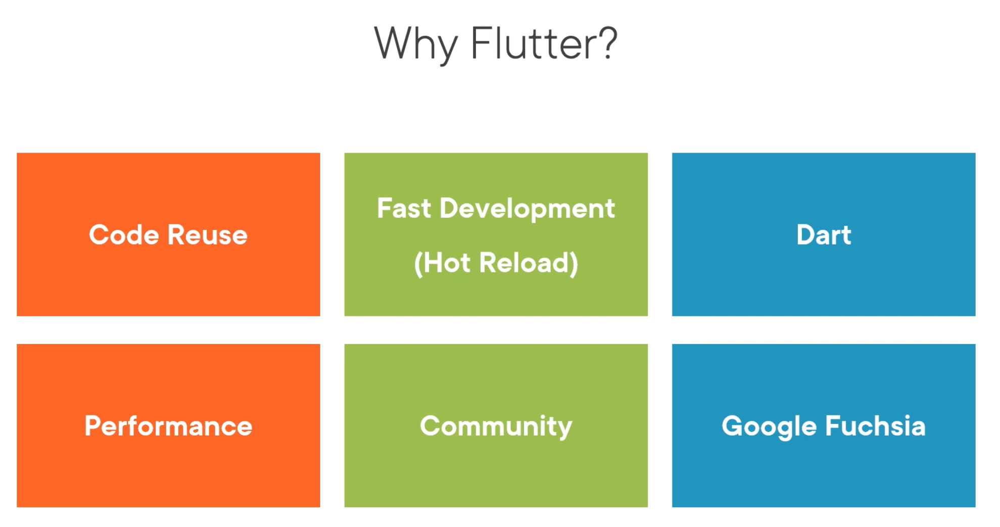

# Flutter

> **Flutter** is a framework to build apps from a single code base.

> **Dart** is strongly typed object oriented programming language, developed by google. 

> **State** is information that might chnage during the lifetime of the widget.

> **Null Safety** by default variables cannot be assigned a null values.

 

## Helpers
- [Dart: prefer constant constructors](https://stackoverflow.com/questions/58136414/dart-prefer-constant-constructors#:~:text=Recently%20the%20flutter%20team%20created%20a%20new%20package%20called%20flutter_lints%20and%20it%20is%20added%20to%20your%20analysis_options.yaml%20by%20default.)

 

## Commands
- flutter version
- flutter doctor
- flutter upgrade
- flutter pub get
- flutter clean

 

## Cocoapods
- pod --version
- sudo gem install cocoapods
- brew upgrade cocoapods

 

## Resources
* [Visual Studio Community](https://visualstudio.microsoft.com/vs/community/)

 

 
